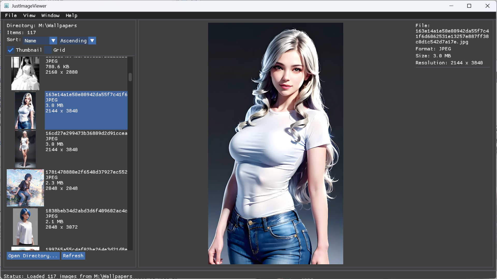

[English](README.md) | [한국어](README_KR.md)

# Just Image Viewer

I started creating this because I needed an image viewer that I could use on both my Windows PC and Mac, and that I could easily extend with new features. I also wanted to test the capabilities of Codex.

An image viewer built using Rust, winit, wgpu, and imgui-rs.
It supports cross-platform.
It has a limitation dependent on the GPU's maximum texture size.



Tested and in use on Windows 11 and Apple Silicon Mac.

## Development Tools

- Codex and Windsurf

## Features

- Directory (folder) based image browsing
- Open a single image or directory from the command line
- Open images via drag and drop
- Display thumbnail list
- Display image information
- Image selection area and copy to clipboard
- Save and restore settings
- Imgui theme support ('Dark', 'Light', 'Classic')
- Custom font support
- Local HTTP API support

## Build and Run

Requires Rust stable toolchain.

To run:

```sh
git clone
cargo run
```

Package build

```sh
cargo install cargo-packager
cargo packager
```

## Command-line Options

**`--reset-config`**

Discards the existing configuration file and regenerates it with the bundled default settings.

**`PATH` or `File`**

You can pass an image file or a directory path as an argument.

- If a file path is given: It opens in single file mode.
- If a directory path is given: It scans the images in the directory and shows a list.

## Controls

- **Arrow Left / Arrow Up / Page Up**: Previous image
- **Arrow Right / Arrow Down / Page Down**: Next image
- **Home / End**: First image, Last image
- **Ctrl/Cmd + O**: Open folder
- **Esc**: Deselect

You can also drag and drop a file or folder directly onto the window.

## Configuration File Location

Settings are stored under the user's home directory.

- macOS / Linux: `~/.justImageViewer/settings.toml`
- Windows: `%USERPROFILE%/.justImageViewer/settings.toml`

## Custom Font File Location

Custom font files must be located at the settings file location or in a fonts directory under that location.

## Local HTTP API

The app launches a local HTTP server on the port specified in the `http_port` value of `settings.toml`, provided the value is not 0. This feature is offered as a way to integrate with other programs.

The server runs at `127.0.0.1:<http_port>`.

Endpoints:

- **GET /**: Returns a simple text response to check the server status. Example: "Welcome to Just-Image-Viewer!"
- **GET /select**: Returns the file currently selected in the application.
- **GET /fs/{*path}**: Returns the file corresponding to `path` within the current directory (base directory set by the app).

For detailed behavior, refer to the [src/infra/web_server.rs](src/infra/web_server.rs) file.

## Notes

- Large images exceeding the GPU's maximum texture size will not be displayed.

## License

MIT License
